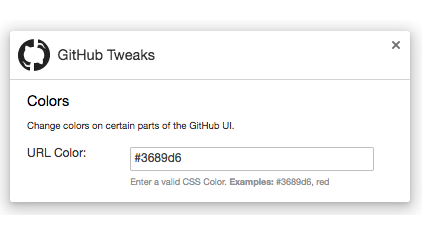
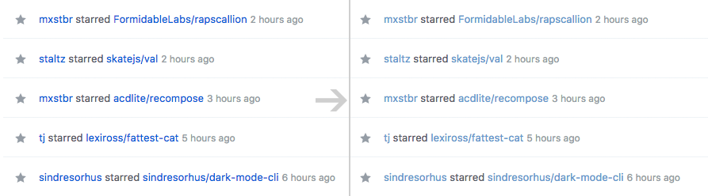

# GitHub Tweaks

> Chrome extension to help protect your eyes from GitHub's new blue url color.

I was inspired to build this extension so that GitHub's new blue url color would
**stop burning holes in my eyes**, and setting my monitor on fire. :eyes: :fire: :desktop_computer: :fire:

In the options, you can choose the url color, and the hover color.

## Install

Install it from the [Chrome Web Store]() or [manually](http://superuser.com/a/247654/6877).

## License

MIT © [Michael Wuergler](http://numetriclabs.com)
